My version of this is on a branch called "custom".

<!-- Header & Preview Image -->

  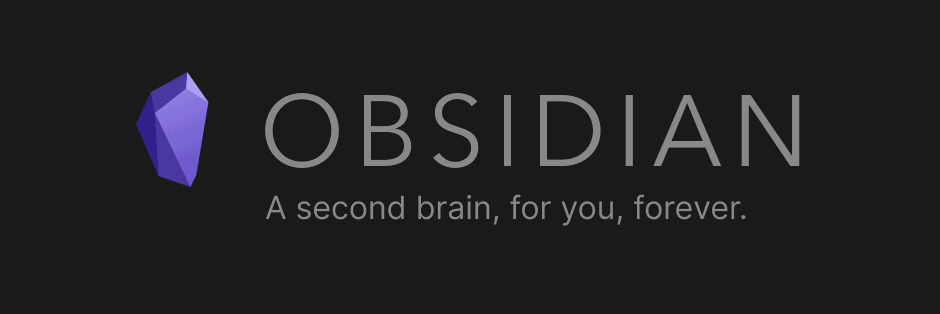

Obsidian For Business
===============================================================================

These macros help you get stuff out of Outlook and into Obsidian quickly. They'll work with any collection of plain-text, or markdown notes.

Obsidian For Business is a combination of a template vault for Obsidian and some Microsoft Outlook VBA Macros. Together, these facilitate a powerful, extensible, and flexible plain text workflow using Microsoft Office and Obsidian.

This repository is my fork of the original [Obsidian for Business by Bryan Jenks](https://github.com/tallguyjenks/Obsidian-For-Business), which was archived on April 2023.

Features
-------------------------------------------------------------------------------

  - Easy macros for making plaintext notes out of emails and calendar meetings
  - Macro to tag email subject lines using [the Johnny Decimal catalog system](https://johnnydecimal.com/concepts/managing-email/)
  - Extract meeting attendees and details
  - A template vault for Obsidian, with example notes and tags

Prerequisites
-------------------------------------------------------------------------------

  - For the macros you will need:
    - Microsoft Windows
    - Microsoft Outlook desktop edition
    - [Microsoft Outlook Macros Enabled](https://support.microsoft.com/en-us/office/enable-or-disable-macros-in-office-files-12b036fd-d140-4e74-b45e-16fed1a7e5c6)
    - Microsoft Office VBA libraries activated
      - Microsoft Forms 2.0 Object Library
      - Microsoft VBScript Regular Expressions 5.5
    - Obsidian is required for the Template Vault, but not for the macros

Installing the Outlook Utilities
-------------------------------------------------------------------------------

1. Take note of the directory where you want notes to be saved from Outlook
2. Open Outlook
3. Press & hold <kbd>Alt</kbd> then press <kbd>f11</kbd>. The Visual Basic Editor will open. You'll see something that looks like this: 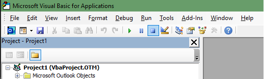
4. The first thing we need to do is activate some library references. Go to `Tools > References`.  
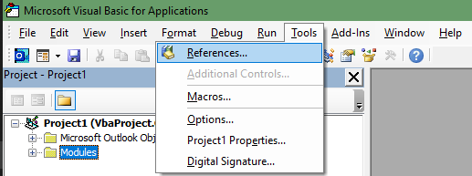
1. The "References" dialog will open, shown below.  
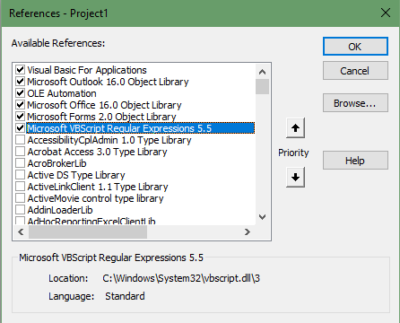
1. Ensure all these items are selected. The 2 necessary ones are:
    - Microsoft Forms 2.0 Object Library
    - Microsoft VBScript Regular Expressions 5.5
If you cant find exact versions like `Microsoft Office 16.0 Object Library` don't worry, your version of Outlook/Office may not use these. Select whatever similar versions are available. (Issues with these tools are unlikely, but if you encounter any, please [file a bug report](https://github.com/tallguyjenks/Obsidian-For-Business/issues/new?assignees=&labels=bug&template=BUG_REPORT.md&title=).)

1. Next we need to get the code into the Outlook Application. For this, you'll need the `.vb` files located in the `VBA Utilities` folder of this repository. You'll copy/paste the code from these macros to use them in Outlook.
2. To start, open the 'Insert Module' dropdown depicted below. Select `Module` then paste in the contents of a `.vb` file. Do this for each macro you want to use, but `USER_CONFIG` and `SaveUtilities` are required.  
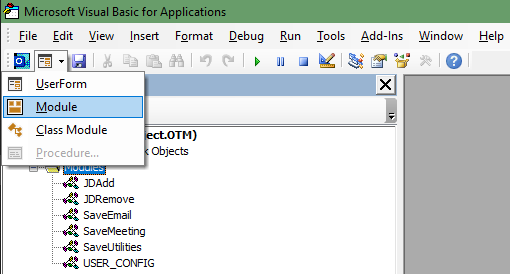
1. You'll need to change the name of each new module. To do this, use the `Properties` window shown below. It should automatically be visible when you open the Editor with the hotkey combo from earlier. Name the modules exactly as you see listed below. (Names should match the original filenames, minus the extension so use `SaveMeeting` for what you pasted from `SaveMeeting.vb`)  
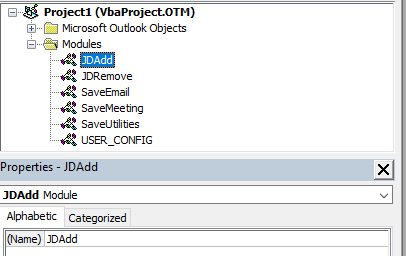
1. Open the `USER_CONFIG` module and edit the `vaultPathToSaveFileTo` variable with the absolute path where you want your files to be sent. You must use a trailing backslash at the end of the path `\`

These steps enable the basic functionality of the macros but you can customize a friendlier setup.  
See [Usage](#usage).

Starting an Obsidian Vault from the Template
-------------------------------------------------------------------------------

1. Download this GitHub repository
2. Explore the notes in the Template Vault. Play, find out what works and doesn't and change what ever you'd like

Usage
-------------------------------------------------------------------------------

After installing the Outlook utilities, you can make them friendlier to use, thanks to the `Quick Access Toolbar in Outlook`.

1. At the top of your Outlook application there will be a little down arrow icon and some other icons in the top left of the application.  
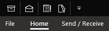
2. Click the down arrow and select the `More Commands` option  
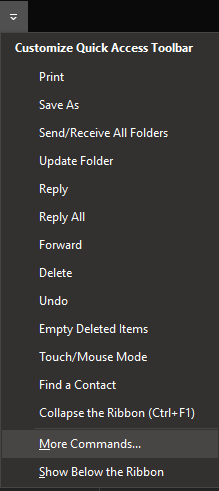
3. You'll get a screen that looks similar to this, under the `Choose commands from` drop down select `Macros` and you'll see a list of the code files we added.
4. because of the way VBA works you cant name the functions the same as the modules so thats why the names differ but it should be fairly obvious which are which.
5. Select the macro items and click the `Add >>` button to move them to the Quick Access Toolbar menu (`<Separators>` are useful for visually separating groups of commands) 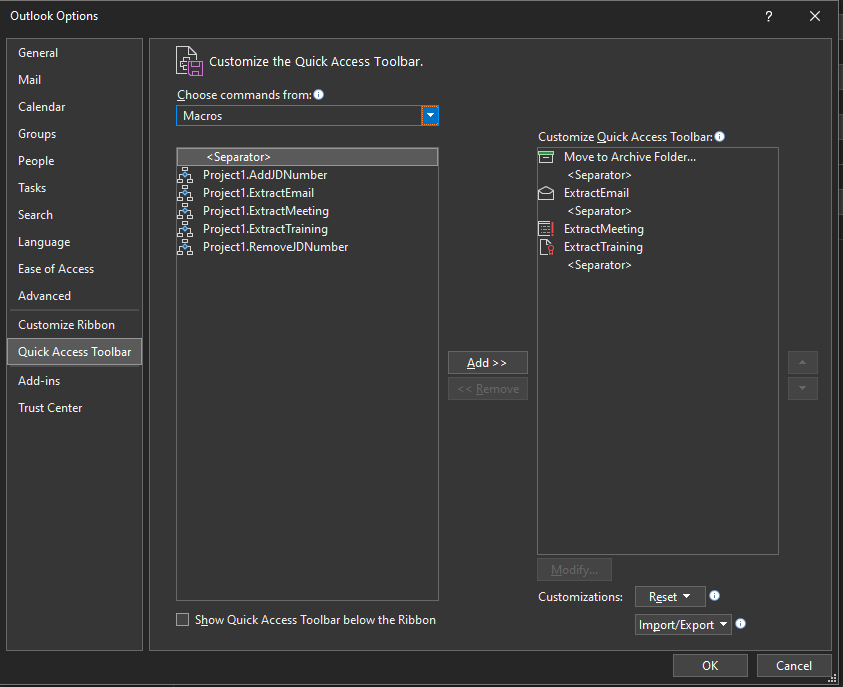
6. Now we can get a little more aesthetic and select a Macro on the right hand side of the dialog box then click `Modify...`  
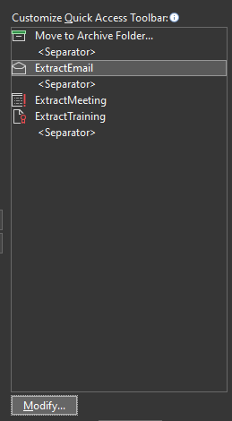
7. This will let you select a custom icon to display on the Quick Access Toolbar for the macro so they are a little more intuitive to view
8. When finished click `Ok` until all menus and windows are closed  
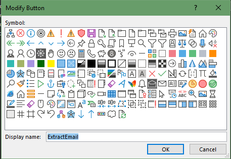

With that all done you'll have some icons on your Quick Access Toolbar to click for your automated actions but to take it a step further, if you simply press <kbd>Alt</kbd> the Quick Access Toolbar will highlight the icons with numbers so you can simply press a number afterwards to run the action for an entirely keyboard-centric workflow:  
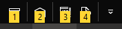

Resources
-------------------------------------------------------------------------------

  - [Obsidian](https://obsidian.md/)
  - [Bryan's YouTube Channel (Lots of Obsidian Videos)](https://www.youtube.com/c/BryanJenksTech?sub_confirmation=1)

License
-------------------------------------------------------------------------------

See [LICENSE](LICENSE)
